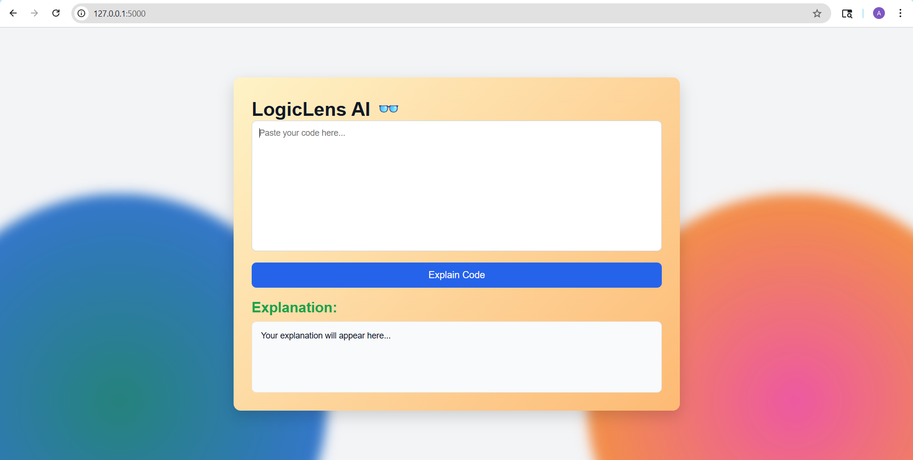
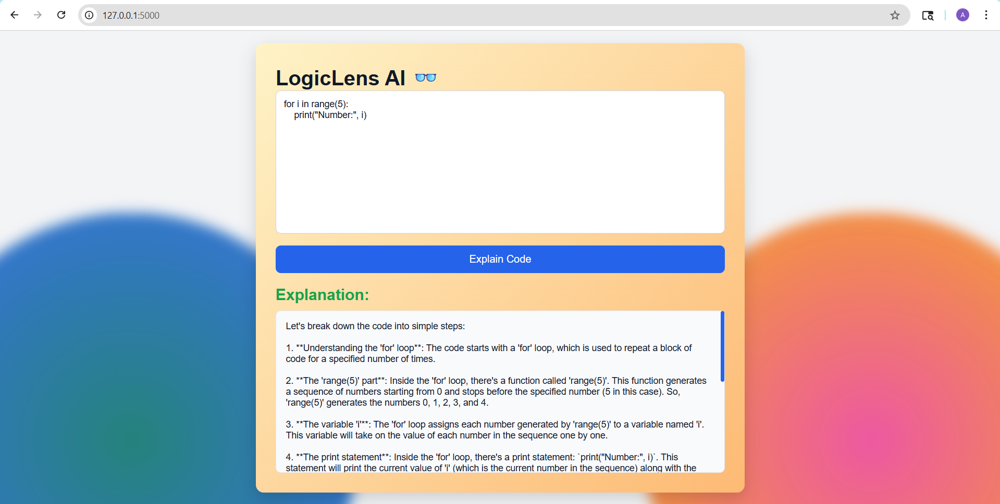

# LogicLens AI 👓

An AI-powered web application that analyzes and explains code in simple, human-readable steps using advanced language models.

---

## 📸 Screenshots

### 🖥️ User Interface

### 🧠 Code Explanation Output

---

## 1. Clone the Repository

git clone https://github.com/apoorvakaroshi/ai-code-explainer.git

cd ai-code-explainer

## 2. Install Dependencies

Install dependencies using:

pip install -r requirements.txt

## 3. Add API Key

Add your API key in `app.py` by replacing:

client = Groq(api_key="YOUR_API_KEY")

## 4. Run the Application

Run the application using:

python app.py

## 5. Open in Browser

Open your browser at: http://127.0.0.1:5000

---

## 💡 Usage

Paste your code → click **Explain Code** → get explanation

---

## 🔮 Future Enhancements

- Multi-language support  
- Voice explanation  
- Code summarization  
- Error detection  

---

## 🧠 Concept

**LogicLens AI** acts as a lens that reveals the underlying logic of code, making complex programs easy to understand.

---

## 🔑 API Key Note

Replace `"YOUR_API_KEY"` in `app.py` with your own Groq API key before running the project.

---

